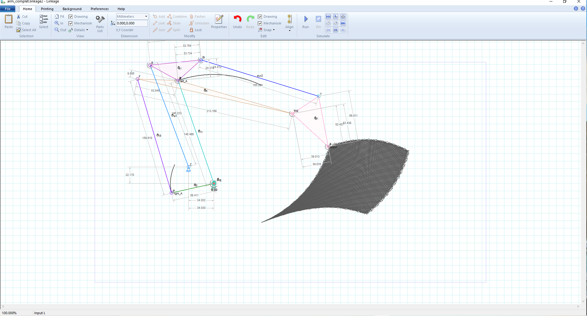
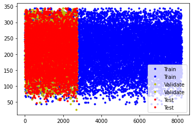
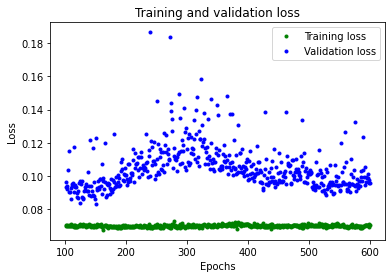
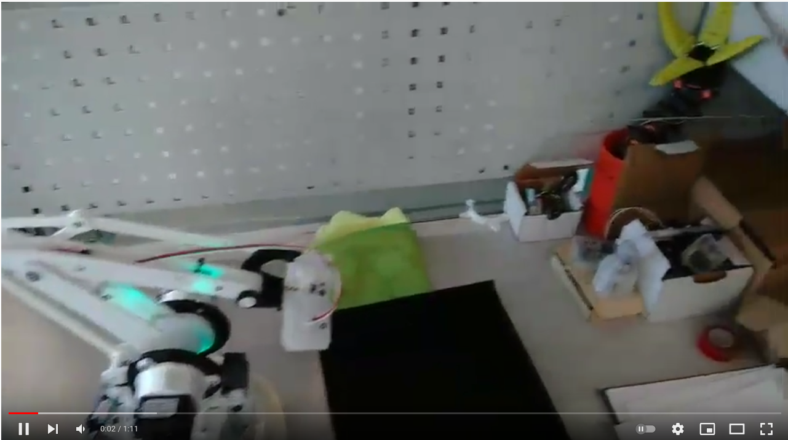

# Inverse kinematics training with neural networks for a robotic arm
Through computer simulations we train a neural network to have the inverse kinematics of an arm manufactured from scratch

## Descripton ##
We currently have a good number of tools that make life easier for us. And if we use them in our projects, they help us to advance a little more.
In this case, we use data obtained from a mechanism simulator to train a neural network through the use of colab, to obtain the inverse kinematic of a robotic arm.


## Key concepts covered ##

- Using the free software [linkage](https://blog.rectorsquid.com/linkage-mechanism-designer-and-simulator/), it allows simulating mechanisms and obtaining data on some points.
- Add Wifi [timer Camera M5](https://shop.m5stack.com/products/esp32-psram-timer-camera-fisheye-ov3660) to the arm to view the part.
- Use fiducial to capture the object and calculate how far away it is.
- Create an extensive database to train a neural network in colab.
- Use Tensorflow in python to get the pulses needed for each motor.

## How does it work ##

Using linkage, I made a model of the robotic arm in 2D, representing only the second and third axes. Obtaining graphically the x, y of the point that represents the center of the gripper and the x, y of each link. We obtain the angle of each joint and with it we train the neural network.




With various simulations, automatic and manual, we obtain about 13,700 data. 60% to train, 20% to validate and 20% to test.





We create a neural network. With colab we can play with models and go testing.

```ruby

model_1 = tf.keras.Sequential()
model_1.add(tf.keras.layers.Dense(50,activation='relu', input_shape=(2,)))
model_1.add(tf.keras.layers.Dense(50,activation='relu'))
model_1.add(tf.keras.layers.Dense(2, activation='linear' ))
model_1.compile(optimizer='rmsprop', loss='mse', metrics=['mae'])
model_1.summary()

```



```ruby

import tensorflow as tf
import math
def demo_arm(cordenates):
    """
         x is the horizontal distance from the center of the fiducial to the center of the image
         y is the distance between the fiducial and the camera
         z is the vertical distance from the center of the fiducial to the center of the image
    """
    conv = 7400/(2*math.pi)
    new_model = tf.keras.models.load_model('arm_new205.h5')
    angle_base = math.asin(x/y)
    pulse_conv= int(angle_base * conv)
    base_pulses = arm_msg.base_current + pulse_conv
    resultado = new_model.predict([(y , z)])
    left_pulses = int(resultado[0][0] * conv) 
    right_pulses = int(resultado[0][1] *conv)
    move_arm(base_pulses, left_pulses, right_pulses)
 
```
The detection with aruco and and to the camera was already treated in another [entry](https://github.com/aescuredo77/Wifi_camera_M5_Ros). It is a work in progress, perhaps for later it is to obtain the three coordinates with the input or even obtain said coordinates with the input of the fiducial. It is an amazing field and we have some good tools to start playing.

[](https://youtu.be/yPhlfRrhBiU )


## Happy new year 2022 ##


